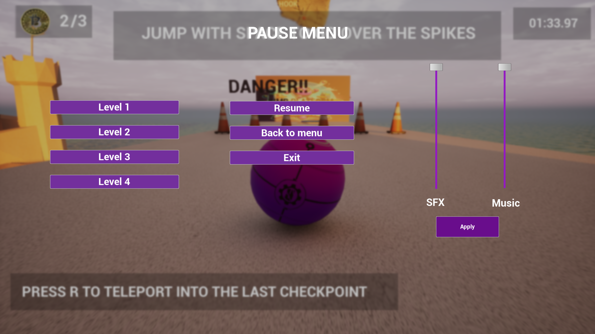

<h1 align="center">🎮 Bounce Ball Challenge</h1>

  <em>Un desafiante juego de plataformas 3D en el que deberás controlar una pelota con precisión para esquivar obstáculos y alcanzar la meta en cada nivel.</em>

---

### 🛠️ Motor del Juego

Desarrollado con **Unreal Engine 5**, aprovechando su potente sistema de físicas y renderizado para ofrecer una experiencia fluida y visualmente atractiva.

---

### 🧩 Descripción del Juego

Bounce Ball Challenge es una experiencia de plataformas en 3D que pone a prueba tus reflejos y tu capacidad de controlar el movimiento de una pelota en escenarios flotantes. 

Tendrás que sortear obstáculos móviles, superficies inestables y acertijos físicos para avanzar por diferentes niveles y llegar a la meta. Cada mundo presenta nuevos desafíos con un estilo visual limpio y colorido que invita tanto a la concentración como a la relajación.

---

### 📸 Capturas del Juego

   
  <em>Menú principal del juego</em>  

  
   
  <em>Ejemplos de niveles en acción</em>  

   
  <em>Menú de pausa accesible en mitad de los niveles</em>

---

### 📂 Estructura recomendada de imágenes

Coloca tus imágenes en una carpeta llamada `screenshots` en la raíz del repositorio:

